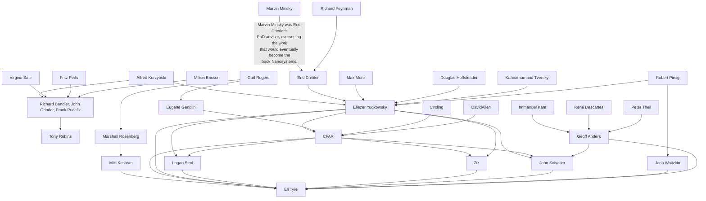

```mermaid
  graph TD;
  
  		AK[Alfred Korzybski]-->EY
  		
  		
  		AK-->NLP[Richard Bandler, John Grinder, Frank Pucelik]
  		VS[Virgina Satir]-->NLP
  		FP[Fritz Perls]-->NLP
  		ME[Milton Ericson]-->NLP
  		NLP-->TR[Tony Robins]
  	
  		

      
      MM[Marvin Minsky]--Marvin Minsky was Eric Drexler's\nPhD advisor, overseeing the work\nthat would eventually become the\nbook Nanosystems. -->ED
      RF[Richard Feynman]-->ED
    
      ED[Eric Drexler]--> EY
      MaxM[Max More]-->EY
      DH[Douglas Hoffsteader]-->EY
      K&T[Kahnaman and Tversky]-->EY
      EY[Eliezer Yudkowsky]-->CFAR
      EY-->LS[Logan Strol]
      
      
      RP[Robert Pirsig]-->EY
      RP-->JW[Josh Waitzkin]
      
      CR[Carl Rogers]-->EG
      EG[Eugene Gendlin]-->CFAR
      CR-->MR
      MR[Marshall Rosenberg]-->MK[Miki Kashtan]
      MK-->ET
      
      Circling-->CFAR
      DA[DavidAllen]-->CFAR
      
      EY-->JS
     
      
      CFAR--> JS[John Salvatier]
      CFAR-->Ziz
      CFAR-->ET
      CFAR-->LS
      
      
      
      IK[Immanuel Kant]-->GA
      RD[René Descartes]-->GA
      PT[Peter Theil]-->GA
      GA[Geoff Anders]-->JS
      
      
      EY[Eliezer Yudkowsky]-->ET
      EY-->Ziz
      LS-->ET
      Ziz-->ET
      JS-->ET[Eli Tyre]
      JW-->ET
      GA-->ET
      
      
```